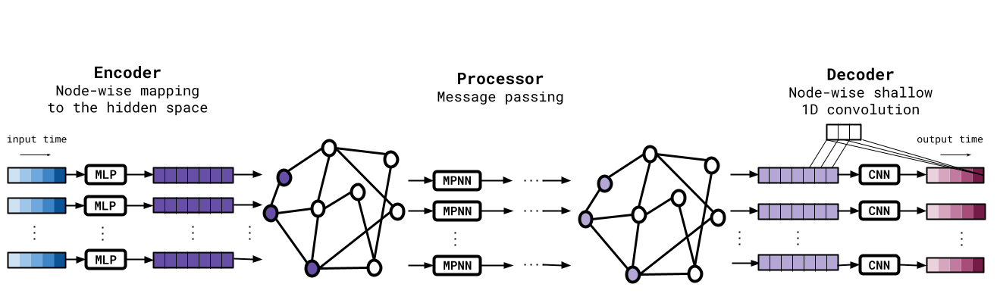
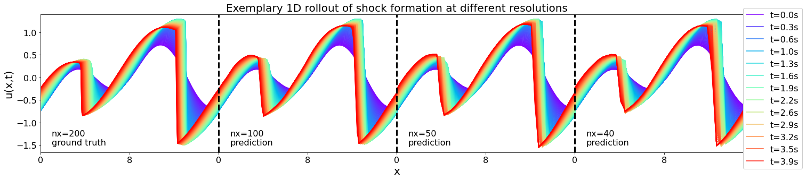

# Baseline commands:

## Training:

Here are the commands for training the baselines for 1D experiments for the [lamp repo](https://github.com/snap-stanford/lamp/):

First, cd into the folder of MP_Neural_PDE_Solvers/. Then, run one of the following commands:

MP-PDE with initial 25 nodes:

```code
python experiments/train.py --device=cuda:0 --experiment=E2 --model=GNN --base_resolution=250,25 --time_window=25 --uniform_sample=4 --id=0
```

MP-PDE with initial 50 nodes:

```code
python experiments/train.py --device=cuda:0 --experiment=E2 --model=GNN --base_resolution=250,50 --time_window=25 --uniform_sample=2 --id=0
```

MP-PDE with initial 100 nodes:

```code
python experiments/train.py --device=cuda:0 --experiment=E2 --model=GNN --base_resolution=250,100 --time_window=25 --uniform_sample=-1 --id=0
```

CNN with initial 25 nodes:
```code
python experiments/train.py --device=cuda:0 --experiment=E2 --model=BaseCNN --base_resolution=250,100 --time_window=25 --uniform_sample=4 --id=0
```

CNN with initial 50 nodes:
```code
python experiments/train.py --device=cuda:0 --experiment=E2 --model=BaseCNN --base_resolution=250,100 --time_window=25 --uniform_sample=2 --id=0
```

CNN with initial 100 nodes:
```code
python experiments/train.py --device=cuda:0 --experiment=E2 --model=BaseCNN --base_resolution=250,100 --time_window=25 --uniform_sample=-1 --id=0
```

FNO with initial 25 nodes:
```code
python experiments/train.py --device=cuda:0 --experiment=E2 --model=FNO --base_resolution=250,100 --time_window=25 --uniform_sample=4 --id=0
```

FNO with initial 50 nodes:
```code
python experiments/train.py --device=cuda:0 --experiment=E2 --model=FNO --base_resolution=250,100 --time_window=25 --uniform_sample=2 --id=0
```

FNO with initial 100 nodes:
```code
python experiments/train.py --device=cuda:0 --experiment=E2 --model=FNO --base_resolution=250,100 --time_window=25 --uniform_sample=-1 --id=0
```

## Analysis:

Use [analysis.ipynb](https://github.com/useruser/MP_Neural_PDE_Solvers/blob/master/analysis.ipynb) to analyze the results for the baselines.


The following is the original README:

# Message Passing Neural PDE Solvers

Johannes Brandstetter*, Daniel Worrall*, Max Welling

<a href="https://arxiv.org/abs/2202.03376">Link to the paper</a>

ICLR 2022 Spotlight Paper

If you find our work and/or our code useful, please cite us via:

```bibtex
@article{brandstetter2022message,
  title={Message Passing Neural PDE Solvers},
  author={Brandstetter, Johannes and Worrall, Daniel and Welling, Max},
  journal={arXiv preprint arXiv:2202.03376},
  year={2022}
}
```





### Set up conda environment

source environment.sh

### Produce datasets for tasks E1, E2, E3, WE1, WE2, WE3
`python generate/generate_data.py --experiment={E1, E2, E3, WE1, WE2, WE3} --train_samples=2048 --valid_samples=128 --test_samples=128 --log=True --device=cuda:0`

Note, to generate the dataset, need to go to [line 13](https://github.com/useruser/MP_Neural_PDE_Solvers/blob/64151880f6683ad42af106cbe1db4656450b709c/temporal/solvers.py#L13) of [/temporal/solvers.py](https://github.com/useruser/MP_Neural_PDE_Solvers/blob/master/temporal/solvers.py) and change this line to `torch.set_default_dtype(torch.float32)`.

###  Train MP-PDE solvers for tasks E1, E2, E3

`python experiments/train.py --device=cuda:0 --experiment={E1, E2, E3} --model={GNN, ResCNN, Res1DCNN} --base_resolution=250,{100,50,40} --time_window=25 --log=True`

### Train MP-PDE solvers for tasks WE1, WE2

`python experiments/train.py --device=cuda:0 --experiment={WE1, WE2} --base_resolution=250,{100,50,40} --neighbors=6 --time_window=25 --log=True`

### Train MP-PDE solvers for task WE3

`python experiments/train.py --device=cuda:0 --experiment=WE3 --base_resolution=250,100 --neighbors=20 --time_window=25 --log=True`

`python experiments/train.py --device=cuda:0 --experiment=WE3 --base_resolution=250,50 --neighbors=12 --time_window=25 --log=True`

`python experiments/train.py --device=cuda:0 --experiment=WE3 --base_resolution=250,40 --neighbors=10 --time_window=25 --log=True`

`python experiments/train.py --device=cuda:0 --experiment=WE3 --base_resolution=250,40 --neighbors=6 --time_window=25 --log=True`

